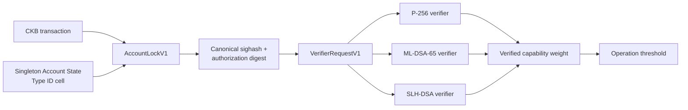

# CKB Crypto-Agile Account Reference v0.1

[](https://github.com/toastmanAu/ckb-crypto-agile-account-reference-v0.1/actions/workflows/ci.yml)
[](LICENSE)

An unaudited Rust reference implementation of the frozen AccountLockV1,
AccountStateV1, AccountWitnessV1, authorization digest, and Verifier ABI v1
protocols for Nervos CKB.

The account's asset lock never changes when authenticators or verifier
implementations rotate. Algorithm-specific cryptography lives in replaceable
child verifiers, while AccountLock handles only state identity, transaction
binding, capability thresholds, and the verifier ABI.

Implemented authentication profiles:

- WebAuthn ES256 using P-256
- ML-DSA-65 using the RustCrypto profile
- SLH-DSA/FIPS205 SHA2-128s using the RustCrypto adapter

Positive cryptographic tests execute the optimized RISC-V verifier binaries in
CKB-VM. Host-only signature checks are not counted as protocol conformance.

> This repository is reference code, not audited production software. Read
> [SECURITY.md](SECURITY.md) before evaluating it for deployment.

## Protocol status

| Component | Status |
|---|---|
| AccountLockV1 args and state identity | Implemented and VM-tested |
| AccountStateV1 and AccountWitnessV1 | Implemented with mutation corpus |
| Canonical CKB group sighash | Implemented and transaction-mutation tested |
| Authorization digest v1 | Implemented and state/transaction bound |
| VerifierRequestV1 spawn/pipe transport | Implemented and VM-tested |
| WebAuthn ES256/P-256 | Verified inside CKB-VM |
| ML-DSA-65 RustCrypto profile | Verified inside CKB-VM |
| SLH-DSA SHA2-128s profile | Verified inside CKB-VM |
| Type ID creation, update, and deletion rejection | VM-tested |
| Migration, verifier upgrade, and delayed recovery | Chained VM story |
| Testnet deployment | Not published |
| Independent audit | Not performed |

The normative requirements are in
[docs/REFERENCE_IMPLEMENTATION_SPEC.md](docs/REFERENCE_IMPLEMENTATION_SPEC.md).
Those protocol bytes take precedence over explanatory text in this README.

## Architecture



AccountLock launches each selected verifier with CKB2023 spawn. The parent
writes exactly one length-delimited request through one inherited pipe. Proofs
are never transported in argv. Only child exit status 0 contributes weight.

AccountLock contains no P-256, ML-DSA, SLH-DSA, WebAuthn, JSON, or
algorithm-specific proof parsing.

## Consensus invariants

- AccountLock args are exactly `0x01 || account_id`, totaling 33 bytes.
- `account_id` is the script hash of the singleton Account State Type ID.
- A spend reads exactly one matching state cell dep and cannot consume state.
- Rotation and recovery consume exactly one matching state input and create
  exactly one successor with the byte-identical full Type ID script.
- Successor sequence is exactly current sequence plus one.
- State deletion, duplicate state, and foreign Type ID substitution fail.
- Spend, rotation, and recovery use independent weighted capability thresholds.
- Recovery additionally requires the recovery-enabled flag and configured
  `since` value.
- The common authorization digest binds operation, account ID, sequence,
  current state hash, and canonical group sighash.
- All untrusted offsets and lengths use checked arithmetic. Release builds keep
  overflow checks enabled.

The digest is:

```text
CKB_HASH(
  "CKB_ACCOUNT_LOCK_V1" ||
  operation ||
  account_id ||
  sequence_le_u64 ||
  CKB_HASH(current_state_bytes) ||
  canonical_group_sighash
)
```

## Account lifecycle exercised by the VM suite

The integration story creates one real Type ID state output and one funded
asset output, then carries their exact transaction outpoints forward:

1. Create a P-256 account and fund one asset.
2. Spend the asset with WebAuthn ES256/P-256.
3. Rotate to P-256 plus ML-DSA-65.
4. Reject either proof alone and spend with both at threshold 2.
5. Rotate to ML-DSA-65 plus SLH-DSA SHA2-128s.
6. Spend with either PQ authenticator at spend threshold 1.
7. Reject one-proof rotation and accept both proofs at rotation threshold 2.
8. Rotate the ML-DSA verifier reference to a byte-distinct compatible ELF and
   execute that upgraded verifier.
9. Reject recovery before `since`, accept it at `since`, and return to P-256.
10. Assert the original `0x01 || account_id` on every state and asset output.

See [tests/TEST_MATRIX.md](tests/TEST_MATRIX.md) for the positive and negative
coverage matrix.

## Toolchain

- Rust 1.97.1 stable, pinned by `rust-toolchain.toml`
- `ckb-std` 1.1.0
- `ckb-testtool` 1.1.1
- `riscv64imac-unknown-none-elf` target
- `ckb-debugger` 1.1.1 for debugger-vector replay

The linker configuration follows current CKB script-template conventions and
uses a W^X-safe contract linker script. Capsule is not used.

Install the target and required Rust components:

```sh
rustup component add rustfmt clippy
rustup target add riscv64imac-unknown-none-elf
```

Install `ckb-debugger` 1.1.1 from the official
[ckb-standalone-debugger release](https://github.com/nervosnetwork/ckb-standalone-debugger/releases/tag/v1.1.1)
and place it on `PATH`.

## Build

Build every on-chain program as an optimized RISC-V ELF:

```sh
cargo build --locked --release --target riscv64imac-unknown-none-elf \
  -p account-lock \
  -p verifier-fixture \
  -p verifier-p256 \
  -p verifier-mldsa-adapter \
  -p verifier-slhdsa-adapter
```

Artifacts are written under:

```text
target/riscv64imac-unknown-none-elf/release/
```

## Test and validation

The complete local gate is:

```sh
./scripts/check.sh
```

Its constituent commands are:

```sh
cargo fmt --all -- --check

cargo clippy --locked --workspace --all-targets \
  --exclude account-lock \
  --exclude verifier-fixture \
  --exclude verifier-p256 \
  --exclude verifier-mldsa-adapter \
  --exclude verifier-slhdsa-adapter \
  -- -D warnings

cargo clippy --locked --release --target riscv64imac-unknown-none-elf \
  -p account-lock -p verifier-fixture -p verifier-p256 \
  -p verifier-mldsa-adapter -p verifier-slhdsa-adapter \
  -- -D warnings

cargo test --locked -p ckb-account-protocol -p ckb-account-host -p ckb-account-tests \
  -- --nocapture

ckb-debugger --mode full \
  --tx-file vectors/fixture-spend.json \
  --script input.0.lock \
  --max-cycles 500000000
```

The test suite expects optimized RISC-V binaries when measuring cycles, so run
the release build first. CI performs formatting, host and contract Clippy,
release builds, parser/host/VM tests, conformance-vector reproduction, debugger
replay, and a final clean-worktree check.

## Conformance vectors

Regenerate the deterministic binary vector:

```sh
cargo run -p ckb-account-host --example export_vectors -- \
  vectors/conformance-v1.bin
```

Current SHA-256:

```text
9645f8ee17461940326c81b90f1831bfd412e3370c8248ab50abee5fef4039a6
```

The tracked debugger transactions are updated only when explicitly requested:

```sh
CKB_UPDATE_DEBUG_VECTORS=1 \
  cargo test -p ckb-account-tests fixture_verifier_runs_through_ckb2023_spawn_pipe

CKB_UPDATE_DEBUG_VECTORS=1 \
  cargo test -p ckb-account-tests nonzero_child_exit_contributes_no_weight
```

Normal test runs never rewrite tracked vectors.

## Reference cycles

Representative optimized CKB-VM measurements:

| Path | Cycles |
|---|---:|
| Fixture spawn/pipe spend | 187,707 |
| WebAuthn ES256/P-256 spend | 6,136,398 |
| ML-DSA-65 spend | 14,007,993 |
| SLH-DSA SHA2-128s spend | 20,247,366 |

Cryptographic signing APIs may randomize signatures, so exact instruction paths
can vary slightly. See [CYCLES.md](CYCLES.md) for measurement details.

## Local artifact identities

| Artifact | CKB data hash |
|---|---|
| AccountLock | `0xc546913fec9a02ebdf59c7e22e38bd5d9bb07bea81985c4cf8288040f0480abe` |
| P-256 verifier | `0x376a3e1bfefc57d63cff2e5d022283800fb6b5f014b5edac4be573d58a7b124a` |
| ML-DSA-65 verifier | `0xc4c5b585443a9543e70eb7228cc3a3cacd2ce3a46f4d57523c612c94d210d0b6` |
| SLH-DSA verifier | `0xb0c29ae45ff35bd831d59b38d0417d030be43b7a8be6ec90036005636157cd92` |

These hashes identify the pinned local release ELFs; they are not deployment
outpoints. See [deploy/reference-deployments.json](deploy/reference-deployments.json)
and [docs/DEPLOYMENT.md](docs/DEPLOYMENT.md).

## Integrating AccountLock

A transaction builder or wallet must:

1. Resolve the account's Type ID state and retain its script hash as
   `account_id`.
2. Construct AccountLock args as exactly `0x01 || account_id`.
3. Load and parse the current AccountStateV1 bytes.
4. Select sorted, unique proof slots with the capability and combined weight
   required by the operation.
5. Add exactly one matching state cell dep for spend, or consume/recreate the
   singleton state for rotation/recovery.
6. Add the exact verifier code deps referenced by selected authenticators.
7. Build the transaction with a provisional AccountWitnessV1.
8. Compute the canonical group sighash and common authorization digest.
9. Obtain each algorithm proof over that same digest.
10. Replace the witness lock with the final sorted proofs without changing raw
    transaction fields.

Use the byte-exact helpers in `crates/host`; do not independently reinterpret
the wire layouts from this summary. The schemas and normative specification are
under `schemas/` and `docs/`.

## Deployment

This repository has no claimed testnet or mainnet deployment. Before publishing:

1. Reproduce the release ELFs with the pinned toolchain and locked dependencies.
2. Verify their CKB data hashes against the deployment manifest.
3. Publish AccountLock and verifier code cells.
4. Use CKB2023-compatible script hash types (`data2` for these local ELFs).
5. Record immutable transaction outpoints and code hashes in a network-specific
   manifest.
6. Run the debugger and VM suite against the exact published binaries.
7. Obtain an independent security review.

Detailed steps and the Type ID creation formula are in
[docs/DEPLOYMENT.md](docs/DEPLOYMENT.md). Reproducibility expectations are in
[docs/REPRODUCIBLE_BUILDS.md](docs/REPRODUCIBLE_BUILDS.md).

## Repository map

```text
contracts/account-lock/             protocol, state, threshold, and spawn logic
contracts/verifier-p256/            WebAuthn ES256/P-256 verifier
contracts/verifier-mldsa-adapter/   ML-DSA-65 verifier adapter
contracts/verifier-slhdsa-adapter/  SLH-DSA SHA2-128s verifier adapter
contracts/verifier-fixture/         deterministic ABI test child
crates/protocol/                    no_std wire parsers and validation
crates/host/                        byte-exact encoders and digest helpers
tests/                              CKB-VM integration and migration story
vectors/                            conformance and debugger vectors
deploy/                             local hashes and network references
docs/                               normative and operational documentation
```

## Security and upstream differences

Important limitations include:

- This code has not received an independent audit.
- The ML-DSA adapter uses RustCrypto `ml-dsa` 0.1.1 rather than vendoring the
  referenced `toastmanAu/ckb-mldsa-lock` source.
- The SLH-DSA adapter uses RustCrypto `slh-dsa` 0.2.0-rc.5 rather than the exact
  audited Nervos implementation, so that upstream audit does not transfer.
- The WebAuthn verifier intentionally accepts a stricter flat
  `clientDataJSON` profile than a general JSON implementation.
- Cycle limits and dependency sizes require application-specific budgeting.

See [SECURITY.md](SECURITY.md) for the full deviation and review checklist.

## Versioning and contributions

The wire protocol is frozen at v1. Any incompatible byte-format, domain,
algorithm-ID, threshold, or version change requires a new protocol version; it
must not be folded into AccountLockV1.

Changes should include parser tests and CKB-VM coverage proportional to their
consensus impact. Run `./scripts/check.sh` and leave the worktree clean before
opening a pull request.

## License

MIT. See [LICENSE](LICENSE).
